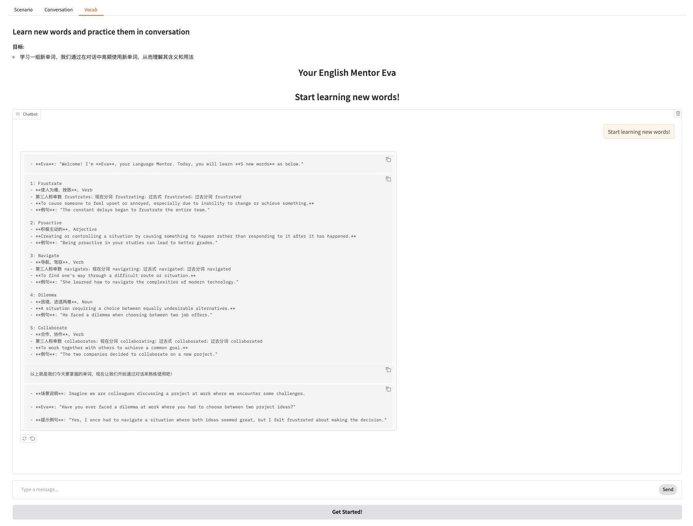

# language_mentor_ai


```bash
# Create and activate a virtual environment
python3 -m venv language_mentor_venv
source language_mentor_venv/bin/activate
pip install -r requirements.txt

# Start the application locally
python src/main.py

# Launch the Gradio UI
# http://localhost:7860

```

in .env file, set the following:

AI_BACKEND=openai
OPENAI_API_KEY=sk-your-key-here


pip install python-dotenv


**Gradio UI**
   open `http://localhost:7860` to start the application.

   vocab：
   
   

